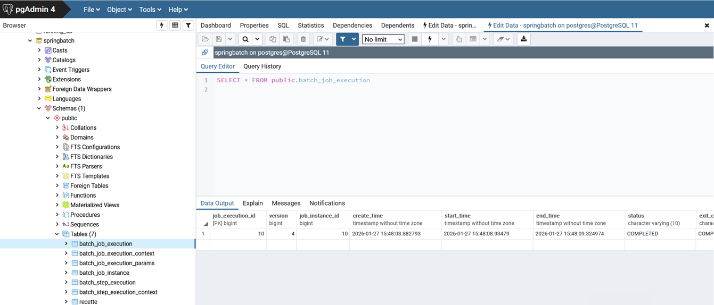
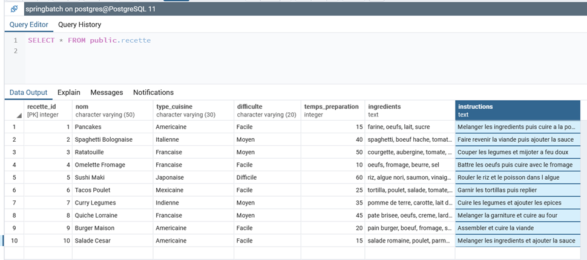

# Spring Batch Application

[[_TOC_]]

## Initialisation de la base de données

### 📄 schema-all.sql
- Crée la table applicative `recette`

### ⚙️ Spring Batch
- Crée automatiquement les tables de métadonnées `BATCH_*` nécessaires au suivi des jobs (JobInstance, JobExecution, StepExecution, etc.)



- Quelles sont les dépendances requises pour générer les tables METADATA (BATCH_*) ?

```xml
<dependency>
<groupId>org.springframework.boot</groupId>
<artifactId>spring-boot-starter-batch-jdbc</artifactId>
</dependency>
```

> [!important]
> Pour que Spring Boot garde le contrôle sur l'autoconfiguration, il est important de ne pas utiliser l'annotation @EnableBatchProcessing.


> [!note]
> Autre scénario : insérer les scripts de création des tables BATCH_* dans le fichier schema-all.sql. Dans ce cas, positionner la propriété spring.batch.jdbc.initialize-schema à never.

## Que fait ce batch ?

Il lit les recettes du fichier liste-recettes.csv pour les insérer en base de données, dans la table RECETTE.



## Remarques

- Le script `schema-all.sql` est exécuté au démarrage de l'application grâce à la propriété :

spring.sql.init.mode=always


## Spring Batch 6 — Mode Resourceless

Depuis Spring Batch 6, il est possible d’exécuter des jobs sans base de données, en utilisant un mode appelé resourceless.

Cela signifie que Spring Batch ne persiste plus les métadonnées d’exécution (jobs, steps, statuts, paramètres) dans des tables SQL.

C'est le comportement par défaut (resourceless) <br/>
https://docs.spring.io/spring-batch/reference/whatsnew.html#_resourceless_batch_infrastructure_by_default

Nouveautés : <br/>
https://docs.spring.io/spring-batch/reference/whatsnew.html

Spring Batch 6 introduit un JobRepository en mémoire (in-memory) :
- Aucune table SQL
- Aucune base de données requise
- Aucune persistance disque

Les métadonnées sont conservées uniquement :

- En mémoire RAM
- Pendant la durée d’exécution du job
- Une fois l’application arrêtée : tout est perdu.

Avantages du mode resourceless

- Démarrage plus rapide
- Configuration simplifiée
- Pas besoin de PostgreSQL / MySQL

Idéal pour :
- Jobs simples
- Traitements ponctuels
- Batchs stateless
- Environnements cloud/serverless
- Tests automatisés

Limitations importantes

Le mode resourceless implique :

- Pas de redémarrage possible (restart)
- Pas d’historique des exécutions
- Pas de reprise après crash
- Pas de monitoring via tables Batch


Comment activer le mode resourceless ?

Avec Spring Batch 6, il suffit de ne pas configurer de datasource Batch.


